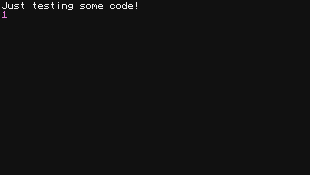

# [eval.tweaked.cc][eval]

Take screenshots of ComputerCraft code

## Usage
```bash
$ curl -d 'print("Just testing some code!")' http://eval.tweaked.cc | display
```



## Limitations
 - Computers can run for at most 10 seconds.
 - Computers do not have internet access.
 - There is some rate limiting on the number of requests one can send at once.

[eval]: https://eval.tweaked.cc
